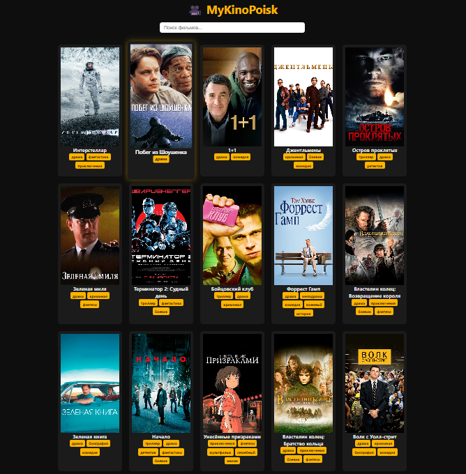

#MyKinoPoisk
 
## Хорошего просмотра

## 💻 Основные технологии
HTML
Файл index.html — создаёт структуру сайта (тексты, картинки, кнопки, блоки).
CSS
Файл style.css — отвечает за дизайн: цвета, шрифты, расположение элементов, адаптивность.
JavaScript
Файл script.js — добавляет логику и интерактивность (например, поиск фильмов, нажатие кнопок, вывод информации).

## Cсылка 
[Демо](./https://app.netlify.com/projects/ubiquitous-salamander-abfeff/overview)
